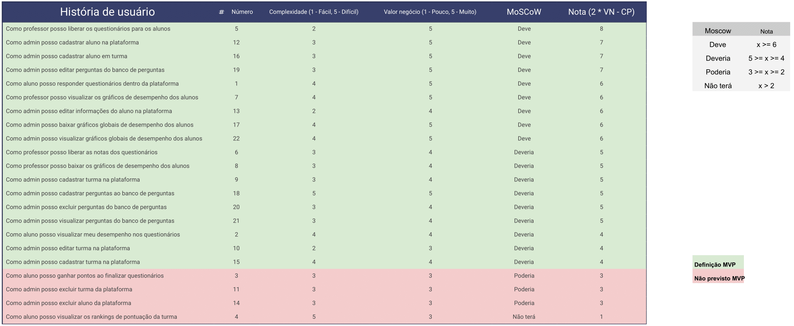

## Product Backlog Building (PBB)

O processo de construir e organizar o backlog escolhido foi o **PBB**.

<iframe width="768" height="432" src="https://miro.com/app/embed/uXjVL6aX70g=/?pres=1&frameId=3458764610749937648&embedId=342470256869" frameborder="0" scrolling="no" allow="fullscreen; clipboard-read; clipboard-write" allowfullscreen></iframe>

## Priorização de requisitos MoSCoW

A planilha, em sua última alteração, pode ser acessada [aqui](https://docs.google.com/spreadsheets/d/e/2PACX-1vQL5DP-U470Z16udMEHnrMGjlRgxlKxCEnvf6jxM4X-bK0PxK98PxexC1vTWRbZsLB-G2l--wVSjE7M/pubhtml)

