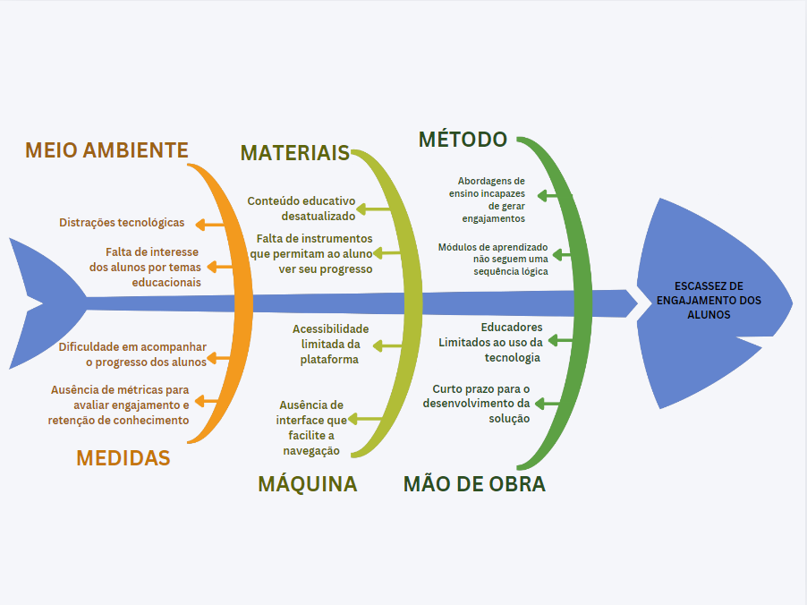

# Ideia Space - Visão do Produto e Projeto

**Versão 1.0**

## Histórico de Revisão

| Data       | Versão | Descrição             | Autor          |
|------------|--------|-----------------------|----------------|
| 01/11/24   | 1.0    | Criação do documento  | Edilson Ribeiro |
| 04/11/24   | 1.0    | Correções do documento | Matheus Brant |

---

# VISÃO DO PRODUTO E PROJETO

## CENÁRIO ATUAL DO CLIENTE E DO NEGÓCIO

### Introdução ao Negócio e Contexto

A Ideia Space é uma startup brasileira de educação que nasceu com o propósito de melhorar a qualidade do ensino no país, especialmente nas áreas de STEAM (Ciência, Tecnologia, Engenharia, Artes e Matemática). Voltada para estudantes e instituições de ensino que buscam novas metodologias, a Ideia Space leva suas atividades diretamente às escolas, proporcionando uma experiência educativa prática e envolvente, sem a necessidade de um espaço físico próprio. Sua proposta é utilizar o fascínio pelo espaço como tema central para envolver e capacitar os alunos em projetos que estimulam a criatividade e a resolução de problemas.

A missão da Ideia Space é tornar o aluno protagonista do processo educacional, utilizando a temática espacial como uma poderosa ferramenta de conexão e transformação. A startup busca engajar os jovens a identificar problemas e desenvolver soluções práticas, como a criação de missões espaciais e a construção de pequenos satélites, incentivando uma formação criativa e prática.

Com o objetivo de se tornar referência em educação na América Latina nos próximos quatro anos, a Ideia Space baseia-se em valores como transformação, excelência, inovação, empoderamento, união, inspiração e respeito.

---

### Identificação da Oportunidade ou Problema

A principal oportunidade identificada para a Ideia Space é uma forma de estender o engajamento e o aprendizado dos alunos para além das salas de aula tradicionais. Muitas abordagens educacionais enfrentam dificuldades em manter o interesse contínuo dos alunos, especialmente fora do ambiente escolar, onde o contato com os conteúdos se torna limitado e menos atrativo. A proposta busca possibilitar que os alunos pratiquem seus conhecimentos de forma gamificada fora de sala de aula.

A necessidade de uma nova abordagem foi intensificada pelo avanço da tecnologia e pela demanda por métodos educacionais mais atrativos e acessíveis. A Ideia Space percebeu que, ao utilizar elementos de gamificação e temas espaciais que despertam curiosidade, pode aumentar significativamente o engajamento dos alunos, promovendo um aprendizado contínuo. Com essa plataforma, a empresa visualiza uma oportunidade de expandir seu impacto educacional, auxiliando os alunos a se manterem motivados e interessados em aprender.

> **Nota**: A figura a seguir apresenta o diagrama de Ishikawa contendo as causas (organizadas pelos 6M’s) e o problema da Ideia Space.

### Desafios do Projeto

Os principais desafios no desenvolvimento do projeto para a Ideia Space envolvem incentivar o aprendizado tanto dentro quanto fora da sala de aula. Entretanto, existem claras dificuldades geradas pela falta de interatividade e a abordagem tradicional de ensino, que contribuem para o desinteresse e a distração, agravada pela presença de tecnologias que muitas vezes competem pela atenção dos estudantes. A ausência de métricas claras para avaliação também dificulta o trabalho dos educadores, tornando o processo de feedback e ajuste pedagógico ineficaz. 

Isso exige o desenvolvimento de mecânicas de gamificação eficazes e motivadoras, evitando que se tornem repetitivas. Identificar as técnicas de gamificação mais adequadas ao público-alvo e traduzi-las em funcionalidades que incentivem o engajamento é crucial para o sucesso do projeto.

---

### Segmentação de Clientes

A Ideia Space atende a dois principais segmentos de clientes:

- **Estudantes do Ensino Fundamental e Médio**: São crianças e adolescentes entre 6 e 19 anos que estão no momento de sua formação acadêmica e pessoal, tendo conhecimentos variáveis a respeito das tecnologias do projeto. Eles buscam atividades para aprender de forma prática e divertida, especialmente nas áreas de STEAM. Por meio de atividades inovadoras, como a criação de missões espaciais, eles se envolvem em projetos que estimulam a criatividade, a resolução de problemas e o trabalho em equipe.

- **Equipe Pedagógica**: Esse grupo faz parte da organização e possui formação em áreas de STEAM, entretanto têm pouco conhecimento sobre as tecnologias a serem utilizadas. Além da educação, buscam também engajar e monitorar o conhecimento de seus alunos fora da sala de aula.
